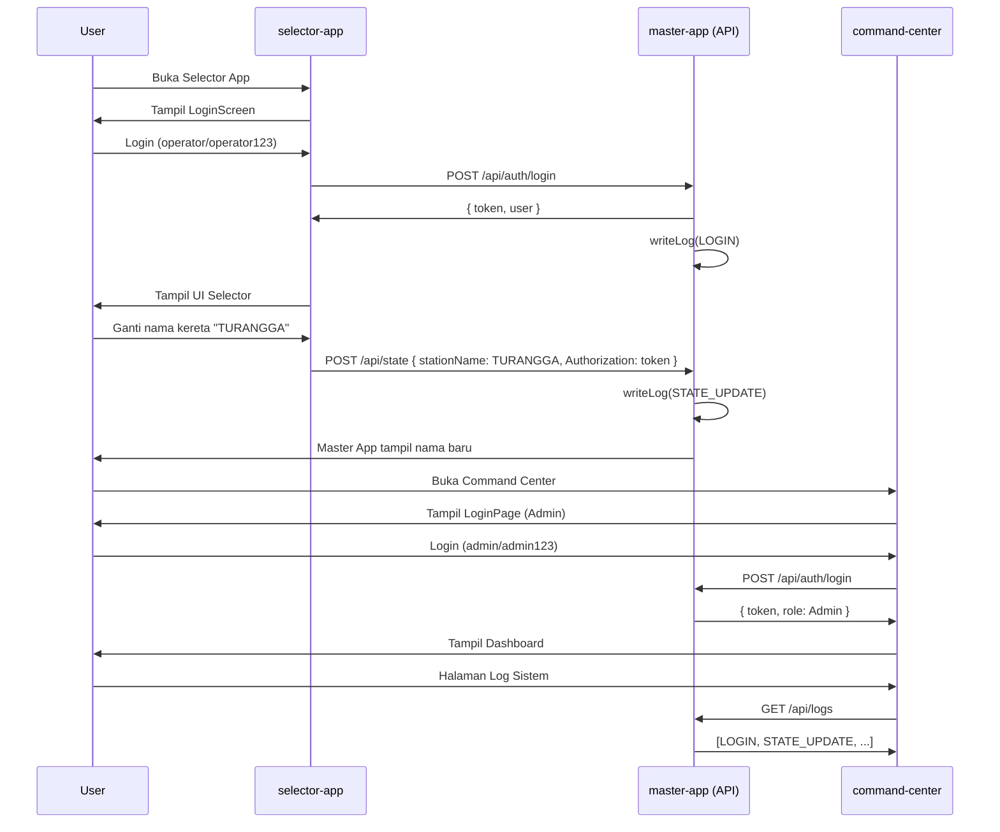

# Eltran PIDS (Passenger Information Display System) - System Documentation

## 1. Executive Summary

The **Eltran-PIDS-Dummy** is a simulation and scaffolding project designed to model the behaviors, constraints, and UI/UX of a real-world Passenger Information Display System for train carriages, specifically adhering to KAI's premium branding and operational parameters.

It is structured using a **Micro-Frontend** architecture wrapped in Electron, allowing distinct hardware components (the Master controller, the LED panels, and the Selector interface) to be developed, tested, and run simultaneously within a single cohesive monorepo.

---

## 2. Architecture Overview

The system is divided into functional "apps" located in the `packages/` directory:

- **`master-app` (Master Controller)**: The central hub. It runs a local Express HTTP server (`localhost:3001`) via its Electron Main Process. This acts as the API Gateway for the entire system, persisting state and serving the mock database. The UI displays the overarching PIDS dashboard, complete with simulated CCTV, GPS coordinates (speed/altitude), and next-station details.
- **`selector-app` (Remote Interface)**: A touchscreen UI module intended for the train announcer or conductor. It fetches the system database from the Master and issues state changes (Train Name, Unit Number, Active Route).
- **`led-app` (Matrix Display)**: Specifically simulates physical LED Dot-Matrix panels (e.g., P10 or P4 variants). It continuously polls the Master's API to draw scrolling text on an HTML5 `<canvas>`.
- **`pids-core`**: A shared library establishing strict TypeScript interfaces (`PidsState`, `RouteData`) ensuring all micro-frontends speak the same language.

### Data Synchronization

Data synchronization relies on a locally hosted REST API (`http://localhost:3001/api/state`). Micro-frontends poll this endpoint or issue POST requests to update the state. This decouples the UI from the filesystem, solving prior cross-process file-locking constraints and paving the way for network-based distribution on a real train topology.

---

## 3. Alignment with Research Specifications

Based on the provided `Research` documents, this project implements the following core concepts:

- **KF-SEL (Selector Specs)**: The separation of concerns is strictly adhered to. The `selector-app` holds the "Configure" logic, allowing operators to send identities to the `master-app`. It now features offline Fallback UIs and Ping/Connection simulations.
- **KF-CTRL (LED Control Specs)**: The `led-app` is capable of simulating both **Indoor (P4 - Amber)** and **Outdoor (P10 - Red)** pixel pitches via url parameter (`?mode=indoor` vs `?mode=outdoor`). The matrix logic processes custom fonts directly on a canvas mimicking hardware limitations.
- **Visual Branding**: Colors (`#1d2d6a` KAI standard Navy, `#ee6f1f` Orange), fonts (Inter/Black), and CSS layout lockdowns (`overflow-hidden`, `user-select-none`) are implemented to prepare the UIs for static Kiosk deployments.

---

## 4. Feature Gap Analysis (Implemented vs. Unimplemented)

### ✅ Currently Implemented

1. **Separated Operational UIs**: Distinct control interfaces (Selector) vs display interfaces (Master/LED).
2. **Local API Gateway**: Centralized data state management over HTTP inside Electron.
3. **Hardware Simulation hooks**: Prepared logical stubs for CCTV (`useCCTVStream`) and GPS (`useGPSStream`).
4. **Physical display simulations**: Precise canvas-based LED matrix simulators resolving pixel-dense differences between indoor and outdoor modules.
5. **System Resiliency**: Global Error Boundaries implemented to prevent "Blank screen/White screen" crashes, redirecting to a branded "System Maintenance" UI.

### ❌ Unimplemented / Missing Features

The following features are conceptually prepared but missing functional backend data:

1. **Real-time CCTV Integation**: Currently uses placeholder mock assets. Requires `WebRTC` or `RTSP` streams.
2. **Live GPS / Telemetry**: Speed and altitude are static strings mimicking data. Requires reading NMEA sentences via serial port (`COM` or `/dev/ttyUSB`) from a physical GPS unit.
3. **Automated Audio Announcer**: Triggering pre-recorded audio `.mp3/.wav` files when approaching a station is not yet implemented.
4. **Offline Sync Handling**: While the system has a connection "Ping" dummy hook, true physical reconnect/disconnect heartbeat logic between the remote TCP nodes is not implemented.
5. **TV/Entertainment Mode Integration**: The system knows when `displayMode = 'tv'`, but hooking into a localized media server (like Emby/Plex or a local video directory) to overlay PiP (Picture-in-Picture) is not fully established.

---

## 5. Requirements for Real-World Implementation vs. Simulation

To transition this software from a pure **Dummy Simulation** into a **Production Real Case**, additional hardware and specific software bridging will be necessary.

### Running the Simulation (Current State)

You DO NOT need any other external hardware or software to run the current simulation.

- **Requirements**: Node.js, NPM.
- **Execution**: Run `npm run dev:all`. It launches `master-app`, `selector-app`, and `led-app` in virtual Electron / Chrome browser windows communicating over `localhost`.

### Transitioning to a Real Case Deployment

In a physical train carriage, these applications will be deployed across constrained hardware nodes.

**1. Hardware Architecture Needed:**

- **Master Node (IPC)**: An Industrial PC (e.g., Advantech, Raspberry Pi 4/5, or Intel NUC) running the `master-app` packaged executable (Windows IoT or Linux).
- **Selector Node (Tablet/Touch Screen)**: An Android tablet, or a smaller embedded touchscreen device running the `selector-app` in Kiosk mode.
- **LED Display Cards**: Native LED panels (e.g., Novastar sending cards or Huidu asynchronous cards).

**2. Software/Driver Integrations Needed:**

- **Serial Drivers (GPS)**: The `node-serialport` library must be installed into `master-app`'s Electron backend to parse real-time localized GPS coordinates (NMEA 0183 protocol).
- **Video Proxies**: For CCTV, you will likely need an RTSP-to-WebRTC proxy (such as `MediaMTX` or standard `FFmpeg`) running as a sidecar process on the IPC to feed real camera streams to the `useCCTVStream` hook.
- **LED Matrix Drivers**: The current `<canvas>` rendering in `led-app` is a visual simulation. In reality, you either:
  1. Output the `led-app` fullscreen via HDMI to a Sending Card (which automatically cuts the picture onto the panels). *Ideal scenario.*
  2. Or, rewrite the LED rendering logic to send raw hex buffers to the LED Controller over TCP/IP or RS232 (bypassing the React app entirely for the LED portion).

### Final Recommendation for Deployment

Build the applications using `npm run build` locally, then package them as standalone executables using tools like `electron-builder`. Install the `master-app` on the main train carriage IPC, open port `3001` on the train's local LAN, and connect the physical Tablets and Displays to that network.

---

## 6. Walkthrough: Command Center, Auth & Logging

Implementasi selesai! Berikut ringkasan semua fitur tambahan.

---

### 6.1 Autentikasi & Keamanan

**Credentials default:**

| Username | Password | Role |
| --- | --- | --- |
| `operator` | `operator123` | Operator |
| `admin` | `admin123` | Admin |

#### Bagaimana Cara Kerjanya

- Setiap app (master, selector, command-center) memiliki **halaman Login** tersendiri sebelum bisa diakses
- Setelah login, token disimpan di `sessionStorage` dan dikirim sebagai `Authorization: Bearer <token>` pada setiap request
- Token diverifikasi via `GET /api/auth/verify` saat app dimuat ulang
- Tombol **Logout** tersedia di setiap app

#### File yang Diubah/Dibuat

- [`api.js`](file:///f:/Muhammad%20Afnan%20Risandi/Projects/Magang/Eltran/PIDS/Dummy/Eltran-PIDS-Dummy/packages/master-app/electron/api.js) — `POST /api/auth/login`, `GET /api/auth/verify`, `POST /api/auth/logout`
- [`master-app/src/components/LoginScreen.tsx`](file:///f:/Muhammad%20Afnan%20Risandi/Projects/Magang/Eltran/PIDS/Dummy/Eltran-PIDS-Dummy/packages/master-app/src/components/LoginScreen.tsx) — UI Login Operator (dark KAI theme)
- [`selector-app/src/components/LoginScreen.tsx`](file:///f:/Muhammad%20Afnan%20Risandi/Projects/Magang/Eltran/PIDS/Dummy/Eltran-PIDS-Dummy/packages/selector-app/src/components/LoginScreen.tsx) — UI Login touchscreen-friendly
- [`master-app/src/App.tsx`](file:///f:/Muhammad%20Afnan%20Risandi/Projects/Magang/Eltran/PIDS/Dummy/Eltran-PIDS-Dummy/packages/master-app/src/App.tsx) — Auth guard + info user di sidebar
- [`selector-app/src/App.tsx`](file:///f:/Muhammad%20Afnan%20Risandi/Projects/Magang/Eltran/PIDS/Dummy/Eltran-PIDS-Dummy/packages/selector-app/src/App.tsx) — Auth guard + logout button

---

### 6.2 Logging (Audit Trail)

Log disimpan otomatis ke file `eltran-pids-logs.json` di `app.getPath('userData')`.

#### Aksi yang Dicatat Otomatis

| Action | Kapan Dicatat |
| --- | --- |
| `SYSTEM` | Saat API server start |
| `LOGIN` | Setiap login berhasil |
| `LOGIN_FAILED` | Percobaan login gagal |
| `LOGOUT` | Setiap logout |
| `STATE_UPDATE` | Saat nama/nomor/stasiun kereta berubah |
| `DISPLAY_MODE` | Saat mode display diubah (PIDS/TV) |
| `LED_CONFIG` | Saat kecepatan LED diubah |
| `ADMIN_CRUD` | Tambah/hapus kereta, rute dari Command Center |

#### Cara Melihat Log

- **Master App** → Sidebar → tab **"Log Aktivitas"** (100 entri terbaru, auto-refresh 5 detik)
- **Command Center** → Halaman **"Log Sistem"** (semua entri, filter per action, auto-refresh 5 detik)

#### File yang Diubah/Dibuat (Command Center)

- [`api.js`](file:///f:/Muhammad%20Afnan%20Risandi/Projects/Magang/Eltran/PIDS/Dummy/Eltran-PIDS-Dummy/packages/master-app/electron/api.js) — `writeLog()` helper + `GET /api/logs` + `POST /api/logs` + logging middleware
- [`pids-core/index.ts`](file:///f:/Muhammad%20Afnan%20Risandi/Projects/Magang/Eltran/PIDS/Dummy/Eltran-PIDS-Dummy/packages/pids-core/index.ts) — Type `LogEntry`, `LogAction`, `AuthUser`, `AuthSession`

---

### 6.3 Command Center (Package Baru)

Package Electron baru yang berjalan di port **5176**, diakses terpisah dari Master App.

#### Halaman & Fitur

```text
command-center-app/
├── 🔐 Login        — Admin-only (role check ketat)
├── 📊 Dashboard    — 4 stats card + connection status + log terakhir
├── 🚂 Kereta       — CRUD nama kereta (tambah/hapus, sync ke selector-app)
├── 🗺  Rute        — CRUD rute + stasiun (auto-generate SVG path)
├── 👥 Users        — List pengguna dengan role
└── 📋 Log Sistem   — Full log viewer dengan 8 filter action
```

#### Cara Menjalankan

> [!IMPORTANT]
> Command Center **wajib** dijalankan bersama Master App karena menggunakan API server yang sama (port 3001).

```bash
# Jalankan semua sekaligus (Master + Selector + Command Center)
npm run dev:all

# Hanya Command Center saja (butuh Master aktif untuk API)
npm run dev:cc           # Vite
npm run electron:cc      # Electron Window
```

#### File yang Dibuat

- [`packages/command-center-app/`](file:///f:/Muhammad%20Afnan%20Risandi/Projects/Magang/Eltran/PIDS/Dummy/Eltran-PIDS-Dummy/packages/command-center-app/) — Package baru
  - `package.json`, `vite.config.ts`, `tailwind.config.js`, `postcss.config.js`, `index.html`, `tsconfig.json`
  - `electron/main.js` — Electron window (port 5176)
  - `src/main.tsx`, `src/index.css`, `src/App.tsx` — Semua 6 halaman dalam satu file
- [`package.json` (root)](file:///f:/Muhammad%20Afnan%20Risandi/Projects/Magang/Eltran/PIDS/Dummy/Eltran-PIDS-Dummy/package.json) — Scripts baru: `dev:cc`, `electron:cc`, `dev:all` diperbarui

---

### 6.4 Alur Lengkap


